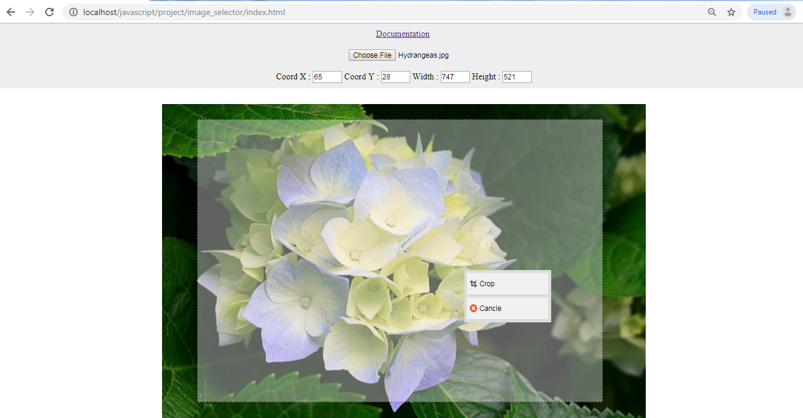

# JC Image Selector</h1>

Javascript Simple Image Selector 
include Javascript file jc_imageSelector.js and enjoy  

  

# Intro
include js File on head

    

# APIs
Parameter

    new JCselector( /Element Target/, /Input File/, /callback Coordinate and Size/, /callback URL img crop/);

#note

    * Element Target      = "IMG Tag target Selector and Preview".
    * Input File          = "Input File to select image".
    * Callback Coordinate = "callback function auto Response Coordinate and Size /x, y, width, height/".
    * Callback URL        = "callback function Response rendered image URL /base64/".

 Parameter Example</b>

    let select  = new JCselector(img, input, myRes, imgRes);

And To Active Function Selector you must be add

    select.on();
if you want to select coordinate and size only

    let select  = new JCselector(img, input, myRes, false);

or you want to select croper only, you cant replace URL callback with boolean true-false or actived the function;

    let select  = new JCselector(img, input, false, imgRes);

# Example 1

    let select  = new JCselector(img, input, false, true);
    select.on();

# Example 2
Arrow Mode

    let select  = new JCselector(img, input, false, (resUrl) => {
      document.getElementById('out-image').src = resUrl;
    });
    select.on();
    
# Example 3
Arrow Mode
Coordinate and Size Response (x, y, width, height)

    let select  = new JCselector(img, input, (res) => {
      document.getElementById('x').src = res.x;
      document.getElementById('y').src = res.y;
      document.getElementById('width').src = res.width;
      document.getElementById('height').src = res.height;
    }, false);
    select.on();

# Full Example

    <!DOCTYPE html>
    <html>
    <head>
      <title>JC Image Selector</title>
      
    </head>
    <body>
      <input id="input" type="file" name="">
        

      <label>Coord X :</label>
      <input type="text" id="x">
      <label>Coord Y :</label>
      <input type="text" id="y">

      <label>Width :</label>
      <input type="text" id="width">
      <label>Height :</label>
      <input type="text" id="height">
       

     

    
    </body>
    </html>
